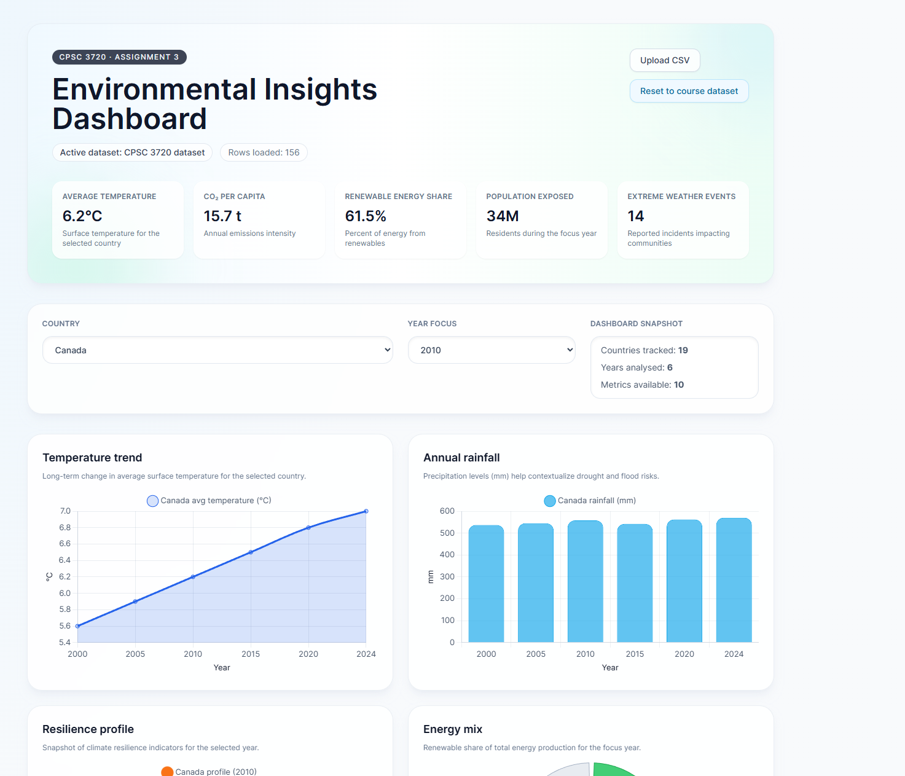

# Point 5 – Methodology

We conducted a literature review and requirements gathering phase grounded in recent component-based engineering work (Laborde et al., 2022)[https://www.researchgate.net/publication/356773566_Reuse_in_component-based_prototyping_an_industrial_experience_report_from_15_years_of_reuse], studied practical architecture guides from Geeksforfeeks (GeeksforGeeks, 2025) [https://www.geeksforgeeks.org/system-design/component-based-architecture-system-design/], and modular dashboard case studies (MathWorks, 2025)[https://blogs.mathworks.com/graphics-and-apps/2025/08/04/creating-a-flight-tracking-dashboard-part-3-using-modular-application-development-principles-to-assemble-the-dashboard/]. Capture stakeholder needs through user stories that emphasize fast data loading, intuitive filtering, and maintainable code.

Our design the system around reusable components DataLoader, FilterPanel, VisualizationEngine organized with high cohesion, loose coupling, and clear interfaces, Pastel colors. Apply patterns such as factories/strategies for chart selection and event-driven communication between modules.

We implemented the data loader and visualization components so every chart consumes a consistent data model. Separate concerns by handling parsing, filtering, and rendering in dedicated modules that can be extended.

We integrated the dashboard by orchestrating configuration, layout, and interactions within a container component that plugs in Chart.js and Plotly views while keeping core logic independent of UI adapters (hexagonal-style).

We finished with testing, results, and documentation: unit-test each module, run integration checks for end-to-end flows (upload --> filter -->  render), validate performance targets (<2 s load), and document component contracts to support reuse.

# Point 7 – Dataset

Use openly available environmental dataset from Kaggle [https://www.kaggle.com/datasets/adilshamim8/temperature]